# Bug List

## Quick Navigation

| Bug | Severity | Concise Description |
|---|---|---|
| [BUG-001](#bug-001) | Critical | Past matches appear in the upcoming matches list. |
| [BUG-002](#bug-002) | Medium | Match cards show dates but no kickoff time. |
| [BUG-003](#bug-003) | Low | Arsenal vs Chelsea shows only `Monday`, not full date/time. |
| [BUG-004](#bug-004) | Critical | Receipt displays incorrect potential payout. |
| [BUG-005](#bug-005) | High | Receipt reverses home/away match order. |
| [BUG-006](#bug-006) | High | Receipt does not show the selected outcome. |
| [BUG-007](#bug-007) | Medium | Place-bet API returns `USD` instead of `EUR`. |
| [BUG-008](#bug-008) | Low | Odds filter range differs from documented min/max. |
| [BUG-009](#bug-009) | High | Reset-balance response differs from persisted balance. |
| [BUG-010](#bug-010) | Medium | Malformed JSON returns `500` instead of `400`. |
| [BUG-011](#bug-011) | High | Header balance stays stale after accepted bet until page refresh. |

---

<a id="bug-001"></a>

## BUG-001: Past Matches Are Displayed in the Upcoming Football Matches List

**Severity:** Critical

**Reproduction Steps:**
1. Open the application.
2. Wait until the match list is loaded.
3. Observe the match list under the heading `Upcoming Football Matches`.

**Expected Result:**  
Only upcoming/pre-match football events should be displayed and available for betting.

**Actual Result:**  
The list shows matches marked as `PAST`, for example:
- Manchester Utd vs Chelsea - Fri 27 Feb;
- Real Madrid vs Barcelona - Fri 27 Feb.

**Business Impact:**  
Users may be able to place bets on past events where the result is already known. This can lead to invalid bet placement, financial loss for the business, and serious trust/compliance issues.

**Evidence:**  
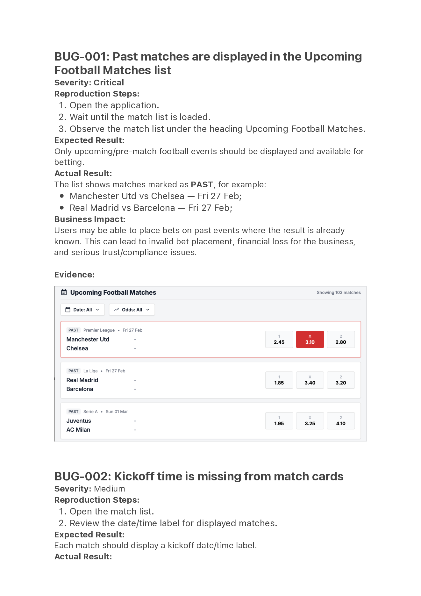

---

<a id="bug-002"></a>

## BUG-002: Kickoff Time Is Missing from Match Cards

**Severity:** Medium

**Reproduction Steps:**
1. Open the match list.
2. Review the date/time label for displayed matches.

**Expected Result:**  
Each match should display a kickoff date/time label.

**Actual Result:**  
Match cards show only date information, for example `Fri 18 Dec` or `Tue 22 Dec`, but no kickoff time is displayed.

**Business Impact:**  
Users cannot clearly understand when the event starts, which may cause confusion and incorrect betting decisions.

**Evidence:**  
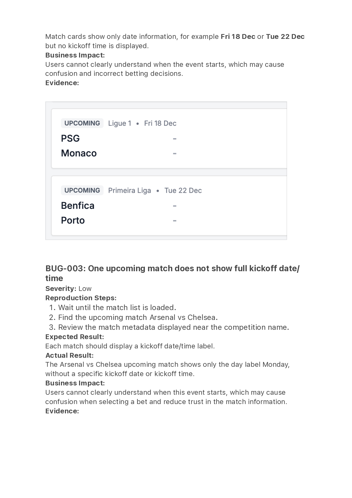

---

<a id="bug-003"></a>

## BUG-003: One Upcoming Match Does Not Show Full Kickoff Date/Time

**Severity:** Low

**Reproduction Steps:**
1. Wait until the match list is loaded.
2. Find the upcoming match Arsenal vs Chelsea.
3. Review the match metadata displayed near the competition name.

**Expected Result:**  
Each match should display a kickoff date/time label.

**Actual Result:**  
The Arsenal vs Chelsea upcoming match shows only the day label `Monday`, without a specific kickoff date or kickoff time.

**Business Impact:**  
Users cannot clearly understand when this event starts, which may cause confusion when selecting a bet and reduce trust in the match information.

**Evidence:**  
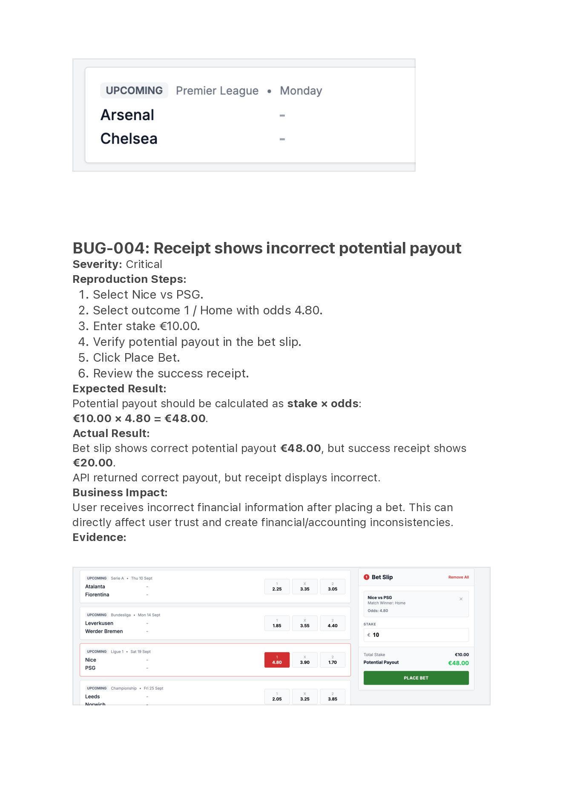

---

<a id="bug-004"></a>

## BUG-004: Receipt Shows Incorrect Potential Payout

**Severity:** Critical

**Reproduction Steps:**
1. Select Nice vs PSG.
2. Select outcome `1` / Home with odds `4.80`.
3. Enter stake `€10.00`.
4. Check potential payout in the bet slip.
5. Click `Place Bet`.
6. Review the success receipt.

**Expected Result:**  
Potential payout should be calculated as `stake x odds`:  
`€10.00 x 4.80 = €48.00`.

**Actual Result:**  
Bet slip shows correct potential payout `€48.00`, but success receipt shows `€20.00`. API returned correct payout, but receipt displays incorrect value.

**Business Impact:**  
User receives incorrect financial information after placing a bet. This can directly affect user trust and create financial/accounting inconsistencies.

**Evidence:**  


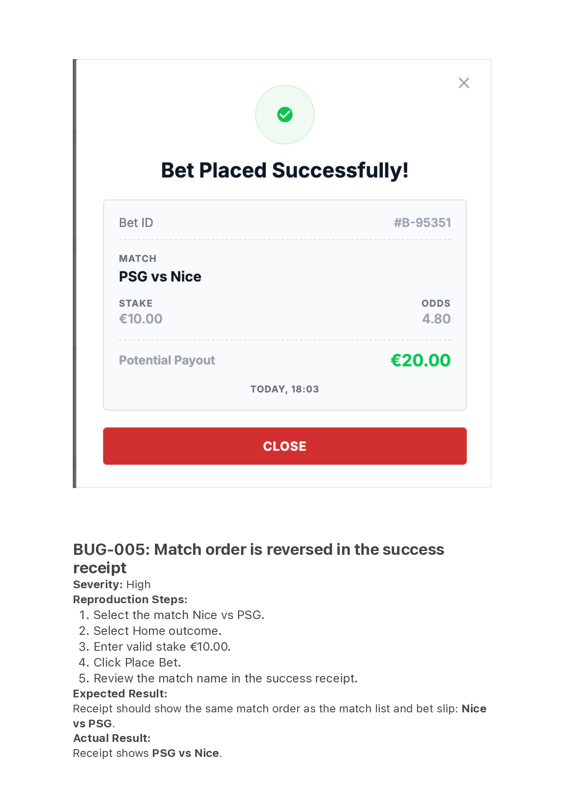

---

<a id="bug-005"></a>

## BUG-005: Match Order Is Reversed in the Success Receipt

**Severity:** High

**Reproduction Steps:**
1. Select the match Nice vs PSG.
2. Select Home outcome.
3. Enter valid stake `€10.00`.
4. Click `Place Bet`.
5. Review the match name in the success receipt.

**Expected Result:**  
Receipt should show the same match order as the match list and bet slip: Nice vs PSG.

**Actual Result:**  
Receipt shows PSG vs Nice.

**Business Impact:**  
Reversed home/away order can misrepresent the selected outcome. Since `Home` depends on team order, this may confuse users about which team they actually bet on.

**Evidence:**  
Bet slip shows Nice vs PSG, but receipt shows PSG vs Nice.

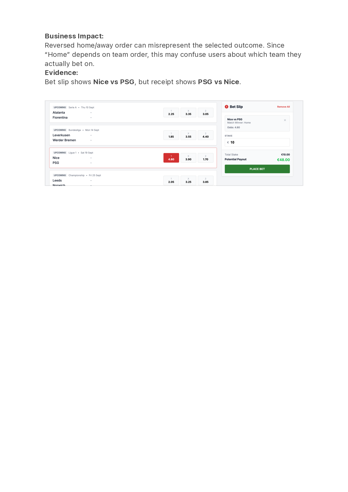

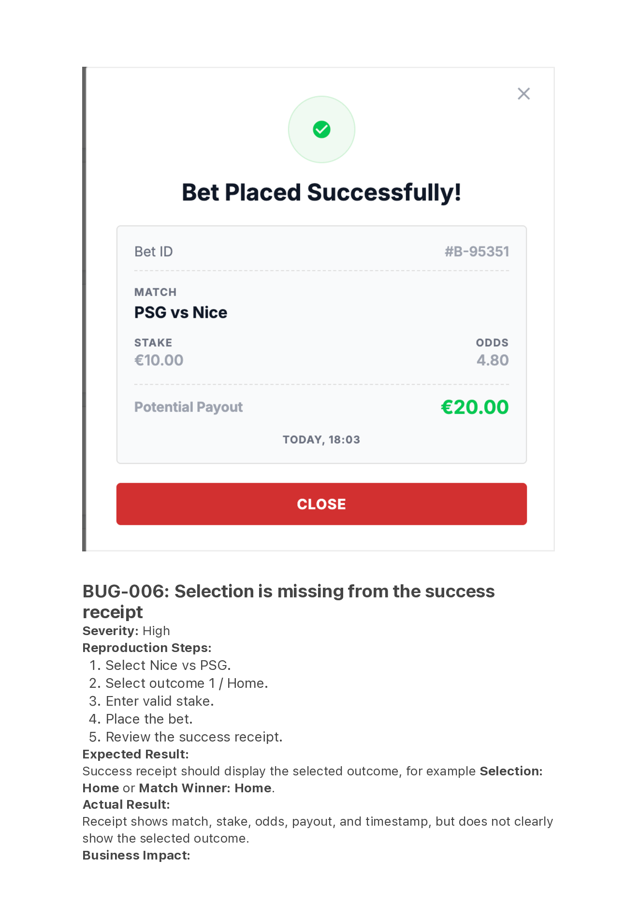

---

<a id="bug-006"></a>

## BUG-006: Selection Is Missing from the Success Receipt

**Severity:** High

**Reproduction Steps:**
1. Select Nice vs PSG.
2. Select outcome `1` / Home.
3. Enter valid stake.
4. Place the bet.
5. Review the success receipt.

**Expected Result:**  
Success receipt should display the selected outcome, for example `Selection: Home` or `Match Winner: Home`.

**Actual Result:**  
Receipt shows match, stake, odds, payout, and timestamp, but does not clearly show the selected outcome.

**Business Impact:**  
User cannot confirm from the receipt which outcome was placed, especially when match order is also reversed.

**Evidence:**  
Bet slip shows `Match Winner: Home`; receipt does not show the selection.

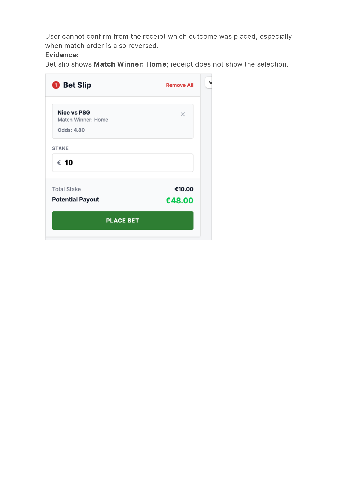

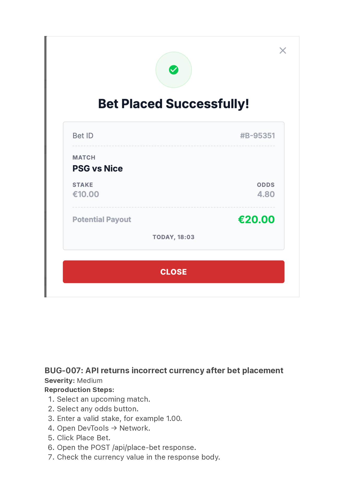

---

<a id="bug-007"></a>

## BUG-007: API Returns Incorrect Currency After Bet Placement

**Severity:** Medium

**Reproduction Steps:**
1. Select an upcoming match.
2. Select any odds button.
3. Enter a valid stake, for example `1.00`.
4. Open DevTools -> Network.
5. Click `Place Bet`.
6. Open the `POST /api/place-bet` response.
7. Check the currency value in the response body.

**Expected Result:**  
`POST /api/place-bet` response should return `currency: "EUR"`.

**Actual Result:**  
`POST /api/place-bet` response returns `currency: "USD"`.

**Business Impact:**  
Currency inconsistency can lead to incorrect financial display and mismatch between API contract and UI.

**Evidence:**  
Network response for `POST /api/place-bet` shows `currency: "USD"`, while requirements specify `currency: "EUR"` and UI displays euro values.

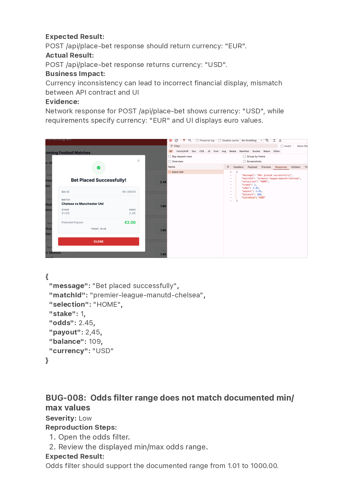

```json
{
  "message": "Bet placed successfully",
  "matchId": "premier-league-manutd-chelsea",
  "selection": "HOME",
  "stake": 1,
  "odds": 2.45,
  "payout": 2.45,
  "balance": 109,
  "currency": "USD"
}
```

---

<a id="bug-008"></a>

## BUG-008: Odds Filter Range Does Not Match Documented Min/Max Values

**Severity:** Low

**Reproduction Steps:**
1. Open the odds filter.
2. Review the displayed min/max odds range.

**Expected Result:**  
Odds filter should support the documented range from `1.01` to `1000.00`.

**Actual Result:**  
Odds filter displays range from `1.00` to `10.00`.

**Business Impact:**  
The issue has limited user impact for common odds values, but the UI does not fully follow the documented odds boundaries. Users can select a minimum value below the documented minimum and cannot filter odds above `10.00`.

**Evidence:**  
Screenshot shows odds filter range `1.00-10.00`, while requirements define minimum odds `1.01` and maximum odds `1000.00`.

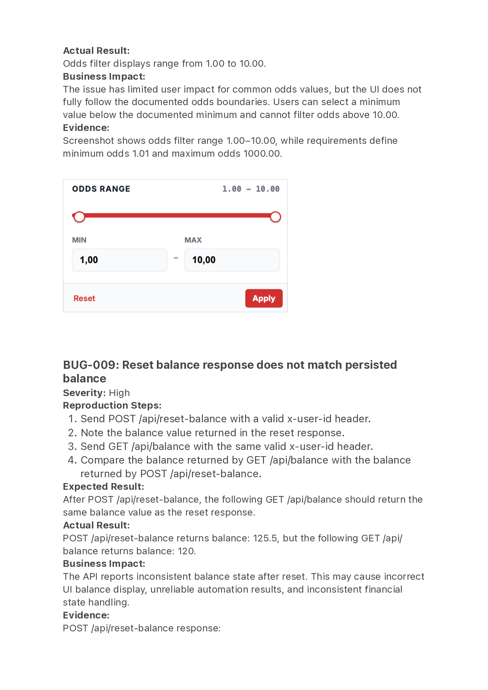

---

<a id="bug-009"></a>

## BUG-009: Reset Balance Response Does Not Match Persisted Balance

**Severity:** High

**Reproduction Steps:**
1. Send `POST /api/reset-balance` with a valid `x-user-id` header.
2. Note the balance value returned in the reset response.
3. Send `GET /api/balance` with the same valid `x-user-id` header.
4. Compare the balance returned by `GET /api/balance` with the balance returned by `POST /api/reset-balance`.

**Expected Result:**  
After `POST /api/reset-balance`, the following `GET /api/balance` should return the same balance value as the reset response.

**Actual Result:**  
`POST /api/reset-balance` returns `balance: 125.5`, but the following `GET /api/balance` returns `balance: 120`.

**Business Impact:**  
The API reports inconsistent balance state after reset. This may cause incorrect UI balance display, unreliable automation results, and inconsistent financial state handling.

**Evidence:**  
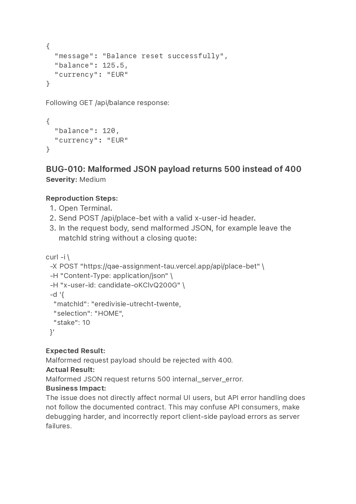

`POST /api/reset-balance` response:

```json
{
  "message": "Balance reset successfully",
  "balance": 125.5,
  "currency": "EUR"
}
```

Following `GET /api/balance` response:

```json
{
  "balance": 120,
  "currency": "EUR"
}
```

---

<a id="bug-010"></a>

## BUG-010: Malformed JSON Payload Returns 500 Instead of 400

**Severity:** Medium

**Reproduction Steps:**
1. Open Terminal.
2. Send `POST /api/place-bet` with a valid `x-user-id` header.
3. In the request body, send malformed JSON, for example leave the `matchId` string without a closing quote:

```bash
curl -i \
  -X POST "https://qae-assignment-tau.vercel.app/api/place-bet" \
  -H "Content-Type: application/json" \
  -H "x-user-id: candidate-oKClvQ200G" \
  -d '{
    "matchId": "eredivisie-utrecht-twente,
    "selection": "HOME",
    "stake": 10
  }'
```

**Expected Result:**  
Malformed request payload should be rejected with `400`.

**Actual Result:**  
Malformed JSON request returns `500 internal_server_error`.

**Business Impact:**  
The issue does not directly affect normal UI users, but API error handling does not follow the documented contract. This may confuse API consumers, make debugging harder, and incorrectly report client-side payload errors as server failures.

**Evidence:**  


---

<a id="bug-011"></a>

## BUG-011: Header Balance Is Not Reduced After an Accepted Bet Until Page Refresh

**Severity:** High

**Reproduction Steps:**
1. Open the application with a valid user ID.
2. Note the current header balance, for example `€120.00`.
3. Select an upcoming match and choose an outcome.
4. Enter a valid stake, for example `€10.00`.
5. Click `Place Bet`.
6. Close the success receipt.
7. Review the header balance without refreshing the page.
8. Refresh the page and review the header balance again.

**Expected Result:**  
After successful placement, the header balance should update immediately to `initial balance - stake`. For example, `€120.00 - €10.00 = €110.00`.

**Actual Result:**  
After closing the receipt, the header balance remains unchanged at `€120.00`. After refreshing the page, the balance updates to the reduced amount.

**Workaround:**  
Refresh the page after placing a bet. The refreshed page shows the reduced balance.

**Business Impact:**  
The UI temporarily shows stale available funds after a successful bet. This may mislead users into thinking their balance was not reduced or that they still have more available funds than they actually do.

**Evidence:**  
Automated UI run observed:

```text
header balance: expected before - stake; before=120.00, stake=10.00, expected_after=110.00, actual_after=120.00
```
